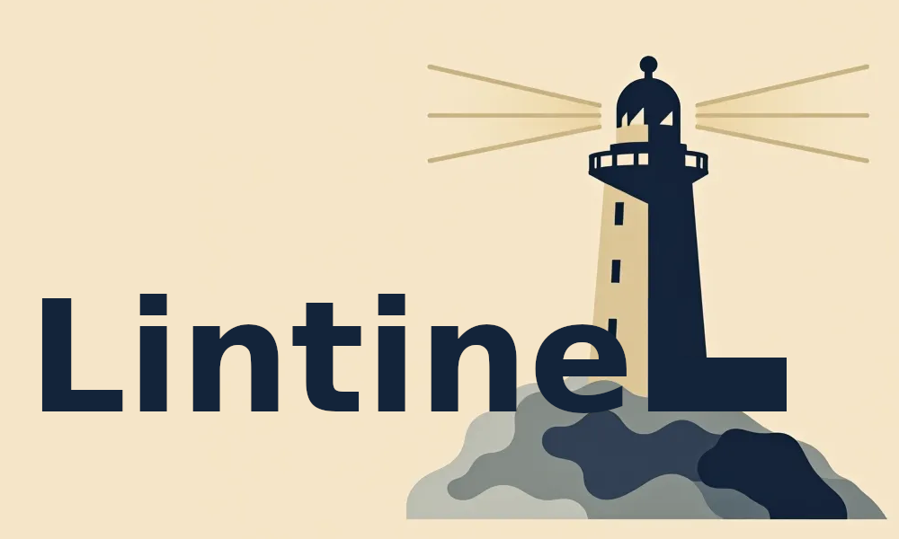

**Lintinel** is your AI-powered DevOps assistant that audits your codebase and infrastructure for best practices, compliance, and quality — and makes smart suggestions using modern LLMs.

> Think of it as a friendly, customizable watchdog for your CI pipelines and GitHub PRs.

---

## What It Does

***NOTE*** This project is in the beginning phases of development.

- ✔️ Lints code and infrastructure files (Docker, YAML, Terraform, etc.)
- ✖️ Suggests improvements via AI (OpenAI, Ollama, Claude, etc.)
  - Only OpenAI is supported currently
- ✔️ Integrates with GitHub PRs or runs as a CLI
- ✔️ Uses a flexible plugin-based rule engine
- ✔️ Extensible by contributors with Python-based rules

---

## Installation

### Run Locally (CLI)

```bash
git clone https://github.com/yourusername/lintinel.git
cd lintinel
pip install -r requirements.txt
```

Add your OpenAI API key to .env
```bash
OPENAI_API_KEY=your-openai-api-key
```

Place a `.lintinel.yml` configuration file in the repo
you want to run lintinel against. See the example in 
this repo.

Usage:
```bash
python main.py /path/to/your/repo
```


### Run with Docker (not yet support)

```bash
docker build -t lintinel .
docker run -v $(pwd):/repo lintinel /repo
```

--- 
## GitHub PR Integration (Webhook Bot)

Lintinel can act as a GitHub App that automatically audits code changes in pull requests and posts comments with lint results.

### Requirements
- A GitHub App registered under your GitHub account

- Your public/private key pair downloaded from GitHub

- Webhook listener exposed (e.g., via ngrok)

- A .env file with the following variables:
```
GITHUB_APP_ID=your-app-id
GITHUB_WEBHOOK_SECRET=your-webhook-secret
GITHUB_PRIVATE_KEY_PATH=./private-key.pem
OPENAI_API_KEY=your-openai-api-key
```

**Keep your private key secure!**
Never commit it to your repository.

### Quick Start
1. Clone this repo and install dependencies:
```
git clone https://github.com/your-username/lintinel.git
cd lintinel
python -m venv venv
source venv/bin/activate
pip install -r requirements.txt
```

2. Start the webhook listener:
```
uvicorn webhook_listener:app --host 0.0.0.0 --port 8000
```

3. Expose it to GitHub (e.g., using ngrok):
```
ngrok http 8000
```
Copy the https:// URL from ngrok.

4. Configure your GitHub App:
- Set the webhook URL to: `https://your-ngrok-url/webhook`
- Subscribe to: `Pull request` events
- Grant permissions:
  - Contents: Read-only
  - Pull requests: Read & Write

5. Install your GitHub App on a test repository
6. Create or update aPR in the test repo.
Lintel will automatically:
  - Clone the repo at the PR's branch
  - Run enabled lint rules
  - Comment the results back on the PR

---
## Example Rules (Initial Set)
| Rule Type	| Description |
|-----------|-------------|
|Dockerfile	| Warn on unpinned image versions (e.g. ubuntu:latest) |
|Terraform	| Warn on unpinned module versions |
|YAML	    | Inconsistent spacing or syntax |
|Git	    | Missing .gitignore, .editorconfig |
|Custom	    | Easily add your own Python rules! |

## AI Integration (Coming Soon)
- Optional LLM-based explainer for PR feedback
- Auto-suggest clean code or infra improvements
- Configurable AI backend (Ollama, OpenAI, etc.)

## Contributing
We’d love your help!
Fork the repo and clone it
Add a new rule to the rules/ folder
Write a test case for it in tests/
Submit a PR

## Roadmap
- Rule plugin engine (stable)
- GitHub App integration
- First round of AI-based feedback
- Web UI (optional)
- CI/CD integration templates

## License
GPLv3

## Credits
Built by Gary Sparks, with inspiration from DevOps pipelines, AI assistants, and all the great open source linting tools that came before.

